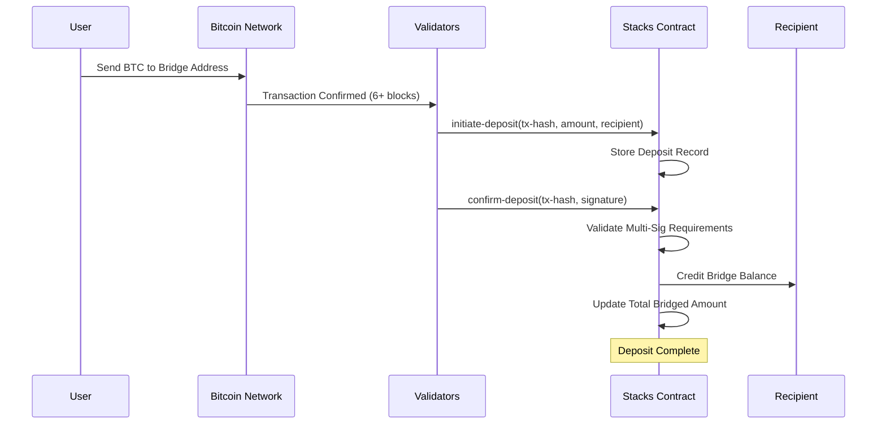
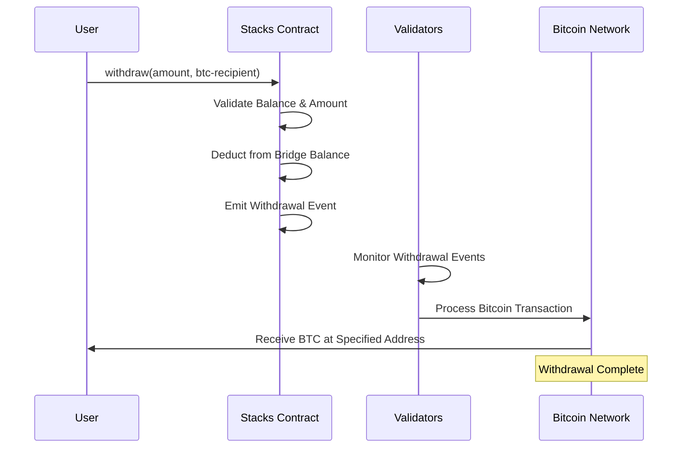

# BTC-STX Bridge Protocol

## 🌉 Seamless Bitcoin-to-Stacks Cross-Chain Bridge

A secure, validator-based bridge protocol that enables Bitcoin deposits to be minted as wrapped tokens on the Stacks blockchain, with multi-signature validation and robust security controls.

---

## 🎯 System Overview

The BTC-STX Bridge Protocol facilitates trustless cross-chain transfers between Bitcoin Layer 1 and Stacks Layer 2, enabling users to bridge their Bitcoin holdings into the Stacks ecosystem while maintaining security through a distributed validator network.

### Key Features

- **🔒 Multi-Signature Security** - Requires multiple validator confirmations
- **⚡ Layer 2 Integration** - Native Stacks blockchain compatibility
- **🛡️ Emergency Controls** - Pause/resume functionality and emergency withdrawals
- **📊 Transparent Tracking** - Complete audit trail of all bridge operations
- **💰 Flexible Limits** - Configurable deposit limits (0.001 - 10 BTC)
- **🔄 Bidirectional Flow** - Seamless deposits and withdrawals

---

## 🏗️ Contract Architecture

### Core Components

```
┌─────────────────────────────────────────────────────────────┐
│                    BTC-STX Bridge Contract                  │
├─────────────────────────────────────────────────────────────┤
│  Administrative Layer                                       │
│  ├── Bridge Management (pause/resume)                      │
│  ├── Validator Management (add/remove)                     │
│  └── Emergency Controls                                     │
├─────────────────────────────────────────────────────────────┤
│  Bridge Core                                               │
│  ├── Deposit Initiation                                    │
│  ├── Multi-Sig Confirmation                               │
│  └── Withdrawal Processing                                  │
├─────────────────────────────────────────────────────────────┤
│  State Management                                           │
│  ├── Deposit Records                                       │
│  ├── Validator Signatures                                  │
│  ├── User Balances                                         │
│  └── Bridge Statistics                                     │
├─────────────────────────────────────────────────────────────┤
│  Validation Layer                                           │
│  ├── Address Validation                                    │
│  ├── Signature Verification                                │
│  ├── Amount Validation                                     │
│  └── Transaction Hash Verification                         │
└─────────────────────────────────────────────────────────────┘
```

### Data Structures

**Deposits Map**

```clarity
{
  tx-hash: (buff 32)           // Bitcoin transaction hash
  amount: uint                 // BTC amount (satoshis)
  recipient: principal         // Stacks recipient address
  processed: bool              // Confirmation status
  confirmations: uint          // Current confirmation count
  timestamp: uint              // Block height timestamp
  btc-sender: (buff 33)        // Bitcoin sender address
}
```

**Validator Network**

```clarity
validators: principal -> bool           // Authorized validators
validator-signatures: {tx-hash, validator} -> {signature, timestamp}
```

---

## 🔄 Data Flow

### Deposit Flow (Bitcoin → Stacks)



### Withdrawal Flow (Stacks → Bitcoin)



---

## 🚀 Quick Start

### Prerequisites

- Stacks blockchain node or testnet access
- Clarity development environment
- Bitcoin testnet/mainnet for testing

### Deployment

1. **Deploy Contract**

```bash
clarinet deploy --network testnet
```

2. **Initialize Bridge**

```clarity
(contract-call? .btc-stx-bridge initialize-bridge)
```

3. **Add Validators**

```clarity
(contract-call? .btc-stx-bridge add-validator 'SP1ABC...)
```

### Usage Examples

**Check Bridge Status**

```clarity
(contract-call? .btc-stx-bridge get-bridge-status)
```

**Get User Balance**

```clarity
(contract-call? .btc-stx-bridge get-bridge-balance 'SP1USER...)
```

**Initiate Deposit (Validator Only)**

```clarity
(contract-call? .btc-stx-bridge initiate-deposit
  0x1234567890abcdef...  ;; tx-hash
  u100000000             ;; amount (1 BTC)
  'SP1RECIPIENT...       ;; recipient
  0x02abc123...          ;; btc-sender
)
```

---

## 🔧 Configuration

### Protocol Constants

| Parameter | Value | Description |
|-----------|-------|-------------|
| `MIN-DEPOSIT-AMOUNT` | 100,000 sats | Minimum deposit (0.001 BTC) |
| `MAX-DEPOSIT-AMOUNT` | 1B sats | Maximum deposit (10 BTC) |
| `REQUIRED-CONFIRMATIONS` | 6 blocks | Bitcoin confirmation requirement |

### Error Codes

| Code | Constant | Description |
|------|----------|-------------|
| 1000 | `ERROR-NOT-AUTHORIZED` | Insufficient permissions |
| 1001 | `ERROR-INVALID-AMOUNT` | Amount outside valid range |
| 1002 | `ERROR-INSUFFICIENT-BALANCE` | Insufficient bridge balance |
| 1006 | `ERROR-BRIDGE-PAUSED` | Bridge operations paused |

---

## 🛡️ Security Features

### Multi-Signature Validation

- Requires validator consensus for deposit confirmations
- Prevents single point of failure
- Cryptographic signature verification

### Emergency Controls

- **Bridge Pause/Resume** - Halt operations during emergencies
- **Emergency Withdrawal** - Protocol recovery mechanisms
- **Validator Management** - Add/remove validators as needed

### Input Validation

- Bitcoin address format verification
- Transaction hash validation
- Signature format checking
- Amount range validation

---

## 📊 Monitoring & Analytics

### Key Metrics

- Total bridged amount across all users
- Individual user bridge balances
- Deposit confirmation status
- Validator participation rates

### Event Logging

- Withdrawal events with complete metadata
- Timestamp tracking for all operations
- Comprehensive audit trail

---

## 🤝 Contributing

1. Fork the repository
2. Create a feature branch
3. Implement changes with tests
4. Submit a pull request

### Development Setup

```bash
git clone https://github.com/bolagi-svg/btc-stx-bridge.git
cd btc-stx-bridge
clarinet check
clarinet test
```
